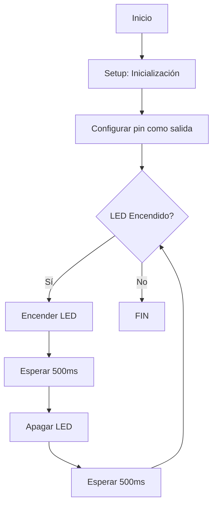
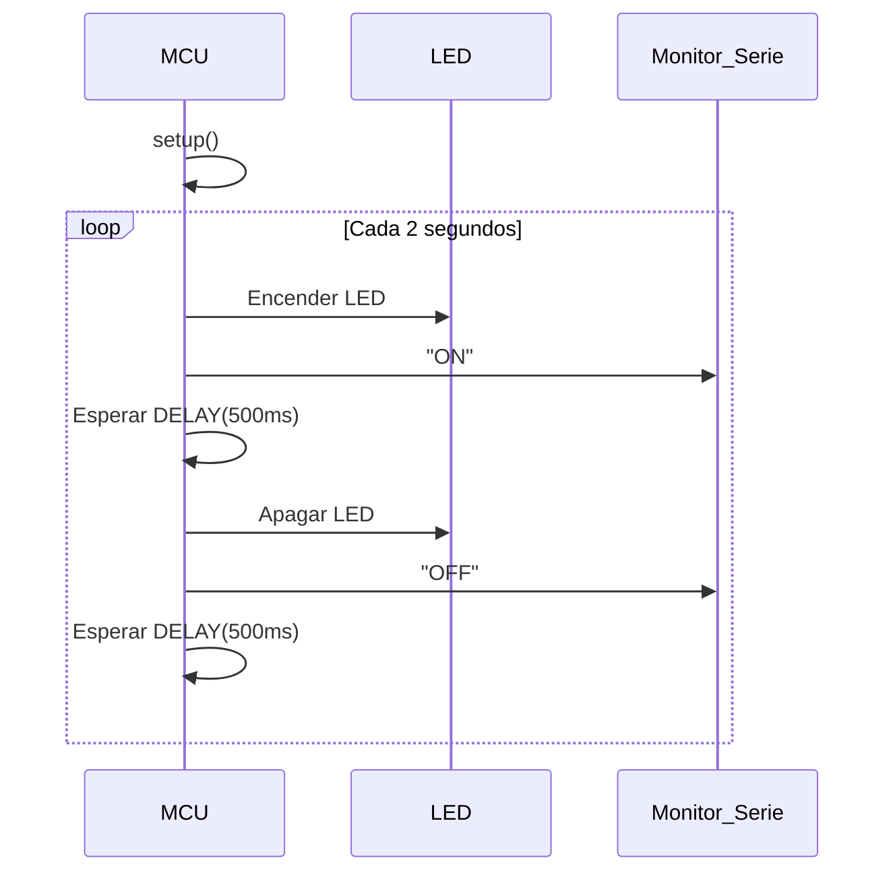

# Practica1
Membres del grup: Alexandre Paskual - Martí Vila

## **_Codigo Base_**

Este es el codigo sobre el que se basa esta practica y sobre el que trabajaremos.
```c++
#include <Arduino.h>
//Definimos un retraso y el pin para conectar el LED
#define LED_BUILTIN 2
#define DELAY 500

//Definimos el pin LED como el pin de salida del programa 
void setup() {
  pinMode(LED_BUILTIN, OUTPUT);
}
//En el loop, podemos observar que para encender i apagar el LED, al tratarse del idioma binario, sólo será necesario cambiar la intensidad de alto a bajo y viceversa. Las ordenes las dirigimos con un Digital Write, que llamarà al pin de salida y le asignara los valores High o Low.
//Añadimos un delay para controlar la frecuencia de la señal.
void loop() {
  digitalWrite(LED_BUILTIN, HIGH);
  delay(DELAY);
  digitalWrite(LED_BUILTIN, LOW);
  delay(DELAY);
}


```

## **Codigo del punto 1.1: Modificación del código para imprimir ON-OFF**
```c++
#include <Arduino.h>

#define LED_BUILTIN 2
 //Mantenemos la definición del PIN out.

#define DELAY 1000
//Aumentamos el Delay a 1 s

void setup() {
Serial.begin(115200);
//Define la velocidad de comunicación serial a 115200 bits/s, para que la información se transmita correctamente a la placa

pinMode(LED_BUILTIN, OUTPUT);

}

void loop() {
    
digitalWrite(LED_BUILTIN, HIGH);
Serial.println("ON");
//Cuando la intensidad del LED aumente, muestra 'ON' en la pantalla.

delay(DELAY);
digitalWrite(LED_BUILTIN, LOW);
Serial.println("OFF");
//Cuando la intensidad del LED disminuya, muestra 'OFF' en la pantalla.

delay(DELAY);
}
```

## **Punto 1.3: Modificar programa para que actue en los registros de entrada de salida.**
```c++
#include <Arduino.h>

#define LED_BUILTIN_PIN 2
#define DELAY 1000 // ms

// Establecer un puntero al registro de salida GPIO
volatile uint32_t *gpio_out = (uint32_t *)GPIO_OUT_REG;

void setup() {
    Serial.begin(115200);  // Inicializa la comunicación serie
    pinMode(LED_BUILTIN_PIN, OUTPUT); // Configura el pin como salida
}

void loop() {
    // Encender el LED activando el bit correspondiente
    *gpio_out |= (1 << LED_BUILTIN_PIN);
    Serial.println("ON");
    delay(DELAY);

    // Apagar el LED alternando el estado del bit correspondiente
    *gpio_out ^= (1 << LED_BUILTIN_PIN);
    Serial.println("OFF");
    delay(DELAY);
}
```

## **Punto 1.4**

Vamos a medir la frecuencia con el osciloscopio, variando el pin de salida y quitando delays, cual es la màxima frecuencia de apagado encendido que permite el microcontrolador.
### **1.4.1: Con el envio por el puerto série del mensaje i utilizando las funciones de Arduino**

EL led de salida sera el 2. No lo cambiamos, ya que el profesor nos dió permiso para mantener el pin que usávamos hasta ahora, ya que no era muy importante. 
El resultado es una frecuencia de 18,36 KHz, en salida.
```c++
#include <Arduino.h>

#define TEST_PIN 2  // Cambia este número a un pin disponible
// Declaramos un puntero a la dirección de memoria del registro GPIO, marcado como volatile  
// para evitar optimizaciones del compilador y asegurar acceso directo al hardware.
volatile uint32_t *gpio_out = (uint32_t *)GPIO_OUT_REG;

void setup() {

    Serial.begin(115200);
    pinMode(TEST_PIN, OUTPUT);
}
void loop() {

    // ===== CASO 1: Con Serial y funciones de Arduino =====
    digitalWrite(TEST_PIN, HIGH);
    Serial.println("ON");
    digitalWrite(TEST_PIN, LOW);
    Serial.println("OFF");
  
}

```

### **1.4.2: Con el envio por el puerto série y accedirendo directamente a los registros**

La frecuencia medida por el osciloscopio es: 18,27 KHz.
```c++
#include <Arduino.h>

#define TEST_PIN 2  // Cambia este número a un pin disponible
volatile uint32_t *gpio_out = (uint32_t *)GPIO_OUT_REG;

void setup() {
    Serial.begin(115200);
    pinMode(TEST_PIN, OUTPUT);
}
void loop() {
        // ===== CASO 2: Con Serial y acceso a registros =====
    *gpio_out |= (1 << TEST_PIN);
    Serial.println("ON");
    *gpio_out ^= (1 << TEST_PIN);
    Serial.println("OFF");

}
```

### **1.4.3: Sin el envio por el puerto série del mensaje i utilizando las funciones de Arduino**

La frecuencia de salida aproximadamente equivale a: 1,250 MHz.
```c++
#include <Arduino.h>

#define TEST_PIN 2 // Cambia este número a un pin disponible
volatile uint32_t *gpio_out = (uint32_t *)GPIO_OUT_REG;

void setup() {
    Serial.begin(115200);
    pinMode(TEST_PIN, OUTPUT);
}

void loop() {
    // ===== CASO 3: Sin Serial y funciones de Arduino =====
    digitalWrite(TEST_PIN, HIGH);
    digitalWrite(TEST_PIN, LOW);
}
```
### **1.4.4: Sin el envio por el puerto série y accedirendo directamente a los registros**

En este caso la frecuencia de salida es de: 3,50 MHz
```c++
#include <Arduino.h>

#define TEST_PIN 2 // Cambia este número a un pin disponible
volatile uint32_t *gpio_out = (uint32_t *)GPIO_OUT_REG;

void setup() {
    Serial.begin(115200);
    pinMode(TEST_PIN, OUTPUT);
}

void loop() {
    // ===== CASO 4: Sin Serial y acceso a registros =====
    *gpio_out |= (1 << TEST_PIN);
    *gpio_out ^= (1 << TEST_PIN);
}

```

## **Punto 1.5**
El diagrama de flujo y diagrama de tiempo
### **1.5.1- _Diagrama de flujo_**


### **1.5.2- _Diagrama de tiempo_**



## **Punto 1.6**
El tiempo libre del procesador se puede determinar con la siguiente fórmula:

**Tiempo libre del procesador = Tiempo total del ciclo - Tiempo empleado en la ejecución del bucle**

Si conocemos el tiempo total de un ciclo, definido y calculado con delay, y el tiempo durante el cual el procesador está ocupado ejecutando el bucle, podemos obtener el tiempo libre simplemente restando ambos valores.


## **Punto 1.7: EJERCICIOS voluntarios DE MEJORA DE NOTA**
Leer el valor del sensor de temperatura interno y sacarlo por el puerto serie.
```c++
//Gracias al consejo del profesor de prácticas, pudimos usar la librería de Adafruit Neopixel, que nos dio las herramientas para proceder con el ejercicio.
//En este ejercicio se podrá apreciar que la salida no solo es una temperatura, sino tambien un color en caso que quisieramos conectar unos leds a nuestra ESP32-S3
  #include <Adafruit_NeoPixel.h>
  #include <Arduino.h>
  
  // Definir el pin y número de NeoPixels
  #define PIN            6
// Se define el número de LEDs que se están usando en la tira que teóricamente deberíamos conectar(16 en este caso).
//Està preparado para devolver colores según la temperatura.
  #define NUMPIXELS     16
  #define DELAYVAL      500  // Tiempo (en milisegundos) para la pausa entre pixeles
  
  // Inicializar el objeto de la librería NeoPixel
  Adafruit_NeoPixel pixels(NUMPIXELS, PIN, NEO_GRB + NEO_KHZ800);
  
  // Definir el rango de temperaturas (ajustar según la temperatura máxima que deseas medir)
  #define MIN_TEMP 0    // Temperatura mínima en °C (en este caso, 0°C)
  #define MAX_TEMP 40    // Temperatura máxima en °C (en este caso, 40°C)
  
  void setup() {
    Serial.begin(115200);  // Inicializa la comunicación serie
    pixels.begin();        //  Inicializa la tira de LEDs.
    analogReadResolution(12);  // Establece la resolución del ADC a 12 bits, lo que permite leer valores entre 0 y 4095.
  }
  
  void loop() {
    // Lee el valor del sensor de temperatura interno
    int rawValue = analogRead(0);  // Lee el valor del sensor de temperatura interno
    float voltage = (rawValue / 4095.0) * 3.3;  // Convierte el valor ADC a voltaje
  
    // Fórmula para convertir el voltaje a temperatura (en °C)
    float temperature = (voltage - 0.5) * 100;  // Convierte el voltaje a temperatura en grados Celsius
  
    // Comprobar que la temperatura esté en un rango razonable
    if (temperature < -40 || temperature > 125) {
      temperature = 24.6;  // Si la temperatura está fuera de un rango razonable, asigna un valor por defecto
    }
    
    // Mostrar la temperatura en el monitor serie
    Serial.print("Temperatura interna: ");
    Serial.print(temperature);
    Serial.println(" °C");
//Esta parte de temperatura por colores no está aplicado al trabajo hecho en clase del laboratorio, así que puede ser ignorado.
//Sin embargo, està debidamente comentado y explicado.
    // Calcular el color basado en la temperatura (mapeamos la temperatura entre MIN_TEMP y MAX_TEMP)
    int colorValue = map(temperature, MIN_TEMP, MAX_TEMP, 0, 255);  // Mapea la temperatura a un valor entre 0 y 255
    
    // Si la temperatura está por debajo del rango, se establece a azul
    if (colorValue < 0) {
      colorValue = 0;
    }
  
    // Si la temperatura excede el rango máximo, se establece a rojo
    if (colorValue > 255) {
      colorValue = 255;
    }
  
    // Asignar colores a cada pixel (verde a rojo, dependiendo de la temperatura)
    for(int i = 0; i < NUMPIXELS; i++) {
      // Mapea el color entre verde (frío) y rojo (caliente)
      int r = colorValue;    // Color Rojo
      int g = 255 - colorValue; // Color Verde (invertido)
      int b = 0;              // Azul (no utilizado en este caso)
  
      pixels.setPixelColor(i, pixels.Color(r, g, b));  // Ajustar color del pixel
    }
    
    pixels.show();  // Mostrar la actualización en los NeoPixels
    delay(DELAYVAL);  // Pausa de 500ms antes de la siguiente actualización
  }
```
El resultado de este ejercicio han sido unos aproximadamente 25 ºC, por lo que suponemos que està funcionando correctamente y lee bien la temperatura de la placa.
